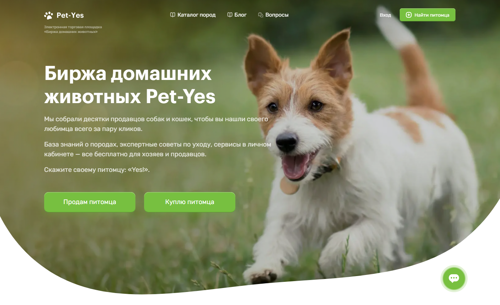
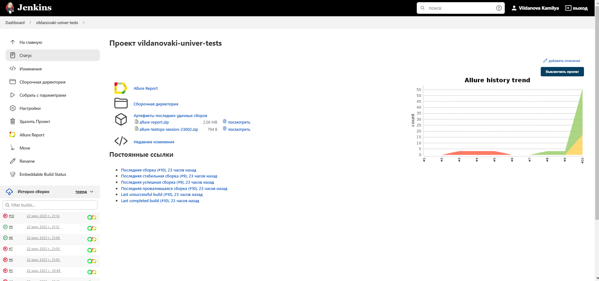
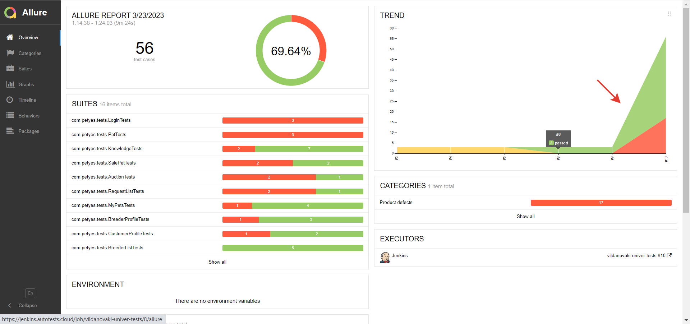
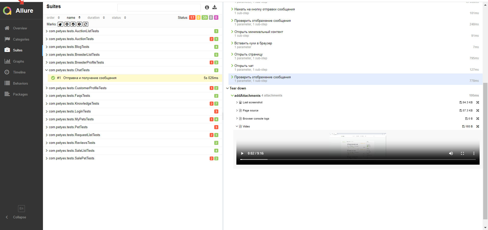
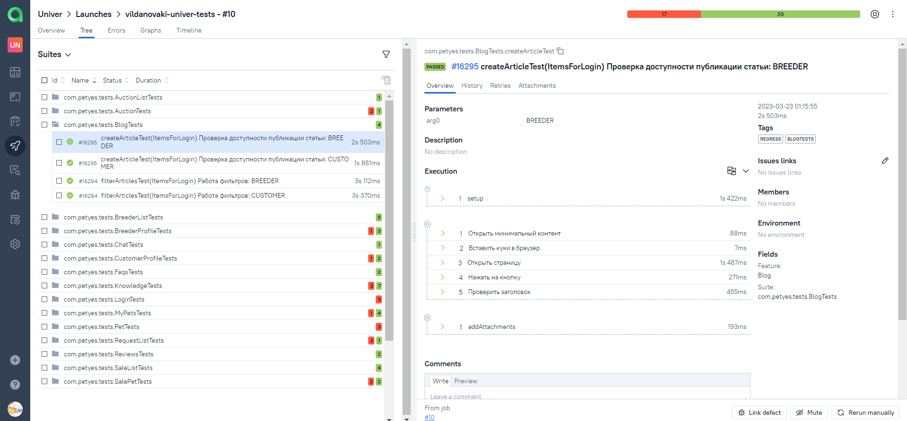
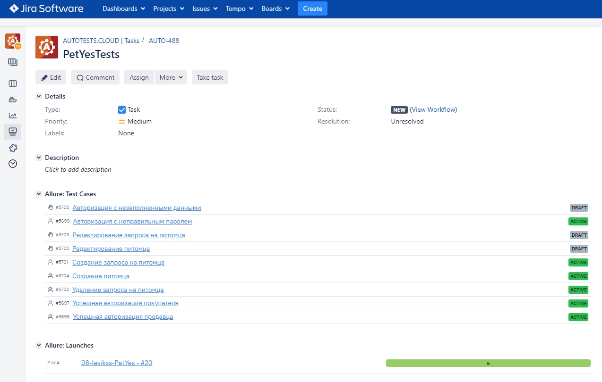
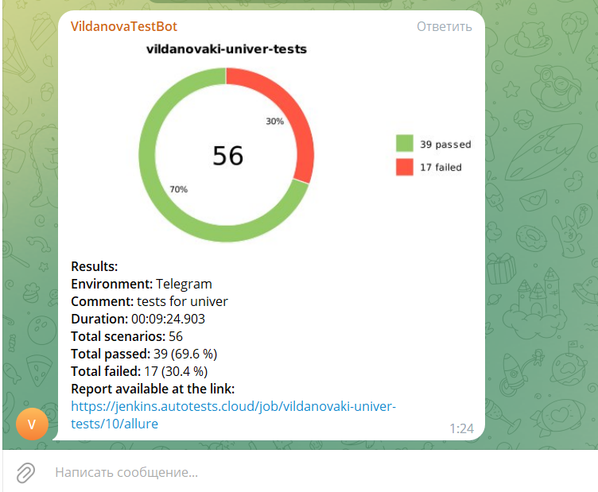

# :feet: Проект с автотестами для сайта pet-yes.com 



## :gear: Стек технологий:
| IDEA | Java | Selenide | Selenoid | Allure Report | Gradle | Junit5 | GitHub | Jenkins | Allure TO | Jira |
|:--------:|:-------------:|:---------:|:-------:|:----:|:------:|:----:|:----:|:------:|:------:|:--------:|
|  |  |  |  |  |  |  |  |  |  |  |
___

## :pushpin: В качестве CI системы использован Jenkins
### [Проект PetYes](https://jenkins.autotests.cloud/job/08-levikss-PetYes/)



## :arrow_forward: Запуск тестов

При запуске тестов можно выбрать окружение, на котором они будут прогоняться. Для этого должен быть файл {env}.properties со следующим содержанием:
```bash
webUrl ={webUrl}
breederPhoneNumber ={phone}
customerPhoneNumber ={phone}
adminPhoneNumber ={phone}
userPassword ={password}
adminPassword ={password}
specialization ={id}
breed ={id}
```

Если файл local.properties заполнен, то для запуска тестов необходимо выполнить следующую команду:

```bash
gradle clean test
```

Если файл local.properties не заполнен, то для запуска тестов необходимо выполнить следующую команду:

```bash
gradle clean test 
-Dbrowser=${BROWSER} 
-DbrowserVersion=${BROWSER_VERSION} 
-DbrowserSize=${BROWSER_SIZE} 
-DbrowserMobileView="${BROWSER_MOBILE}" 
-DremoteDriverUrl=https://user1:1234@${REMOTE_DRIVER_URL}/wd/hub/ 
-DvideoStorage=https://${REMOTE_DRIVER_URL}/video/
-Dthreads=${THREADS}
```
- в параметре Dbrowser - указываем браузер, в котором будут выполняться тесты
- в параметре DbrowserVersion - указываем версию браузера
- в параметре DbrowserSize - указываем размер окна браузера
- в параметре DbrowserMobileView - указываем мобильное устройство, на котором будут выполняться тесты
- в параметре DremoteDriverUrl - указываем логин, пароль и адрес удаленного сервера, где будут проходить тесты 
- в параметре DvideoStorage указываем место для сохранения видео
- в параметре Dthreads задаем количетство потоков

## :bar_chart: Генерация отчета происходит в Allure Report

Для генерации отчета необходимо выполнить следующую команду:

```bash
allure serve build/allure-results
```



К каждому тесту прикладываются:
- Скриншоты
- Исходники страницы
- Логи браузера
- Видео



## :bar_chart: Результаты прохождения тестов записываются в Allure TestOps



## :pushpin: Проект интегрирован с [Jira](https://jira.autotests.cloud/browse/AUTO-488)



## :heavy_check_mark: Уведомления о прохождении тестов отправляются в Telegram

 

## :movie_camera: Видео с прохождением теста "Создание питомца"

 
